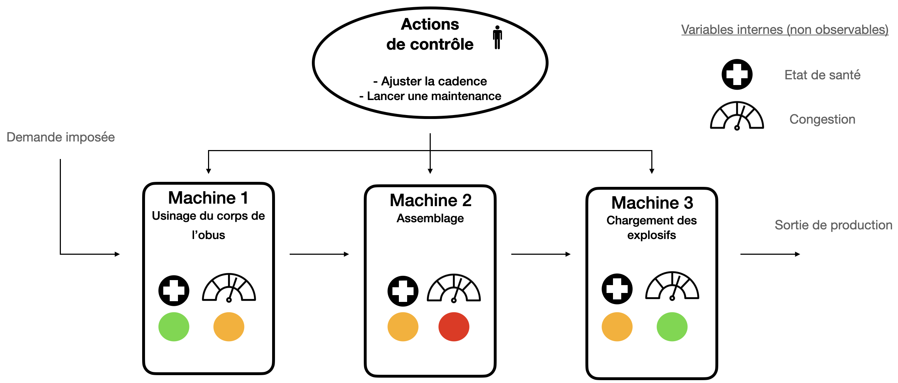

# HackathonPIP2025-Alten AMJE
Simulation, jumeau numérique probabiliste et aide à la décision pour une ligne de production sous contraintes (contexte défense).

## Objectif du projet
Ce dépôt contient une implémentation complète permettant :
- de **simuler** une ligne de production (3 machines en série) soumise à différents scénarios de cadence,
- de construire un **jumeau numérique probabiliste** (modèle espace d’états + filtre de Kalman) pour estimer des variables latentes (santé, congestion),
- de comparer des **stratégies de pilotage** (heuristiques, bandits contextuels sur observations seules vs bandits avec contexte latent),
- de produire une **évaluation économique** (unités produites, revenus, coûts d’arrêt/panne, maintenance, congestion, solde net).

Les résultats sont **reproductibles** grâce à l’utilisation de graines aléatoires (`seed`) et de paramètres explicites.

## Structure du dépôt

hackathonPIP2025/
	src/
		run_experiments.py
		env_munitions.py
		scenarios.py
		twin_kalman.py
		policies.py
		bandit.py
		economic_evaluation.py
		viz.py
	illustration/
		*.png
	README.md
	.gitignore

## Installation (rapide)
Prérequis :
- Python >= 3.9

Dépendances minimales : `$
- `numpy`
- `matplotlib`

Installation via pip (si nécessaire) :

pip install numpy matplotlib

## Lancer les simulations
Le script principal de simulation est `run_experiments.py`.

Pour lancer l’ensemble des expériences :

python run_experiments.py

Ce script exécute automatiquement :
	1.	l’initialisation de l’environnement de production (ligne de machines),
	2.	la génération de plusieurs scénarios de cadence (faible constante, élevée constante, pics, montée en cadence),
	3.	l’exécution de différentes politiques de décision (approche standard vs jumeau numérique),
	4.	la génération de figures comparatives (évolution de la fonction coût),
	5.	le calcul d’un bilan économique agrégé (unités produites, revenus, coûts et solde net).

Les résultats sont affichés :
	•	sous forme de figures Matplotlib,
	•	sous forme de tableaux récapitulatifs imprimés dans la console.

## Paramètres de simulation

Les paramètres principaux sont définis dans run_experiments.py et env_munitions.py :
	•	Horizon de simulation : total_steps = 2000 (interprété comme 2000 jours),
	•	Nombre de machines : défini dans EnvParams,
	•	Mode de reward : reward_mode = "classic",
	•	Graines aléatoires (seed) fixées pour assurer la reproductibilité.

Les hypothèses économiques (prix unitaire, coûts d’arrêt, maintenance, congestion) sont définies dans :
	•	economic_evaluation.py

## Reproductibilité

Les résultats du projet sont entièrement reproductibles :
	•	les graines aléatoires sont fixées,
	•	les scénarios de demande sont déterministes,
	•	les paramètres de simulation et de coûts sont explicitement codés.

Relancer run_experiments.py avec les mêmes paramètres permet de retrouver les mêmes figures et tableaux.

## Auteur

Projet réalisé individuellement par Samuel Ngassam Mbandou.
L’ensemble des aspects du projet (modélisation, implémentation, simulation, analyse) a été pris en charge.
